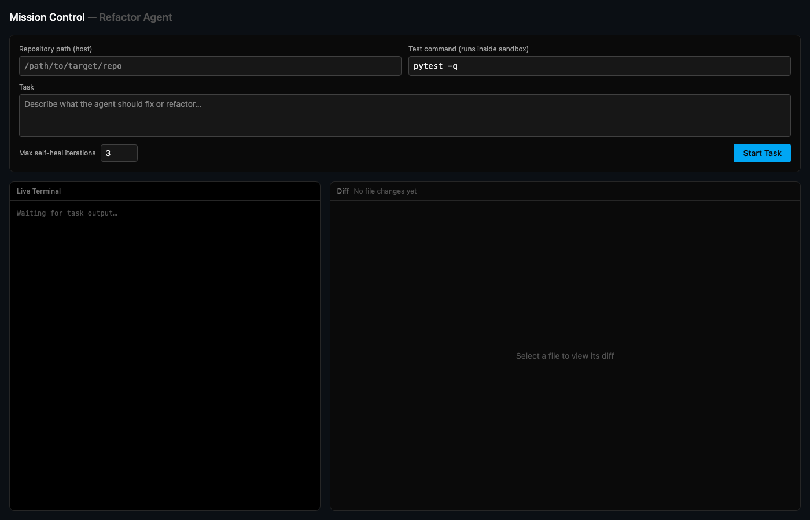
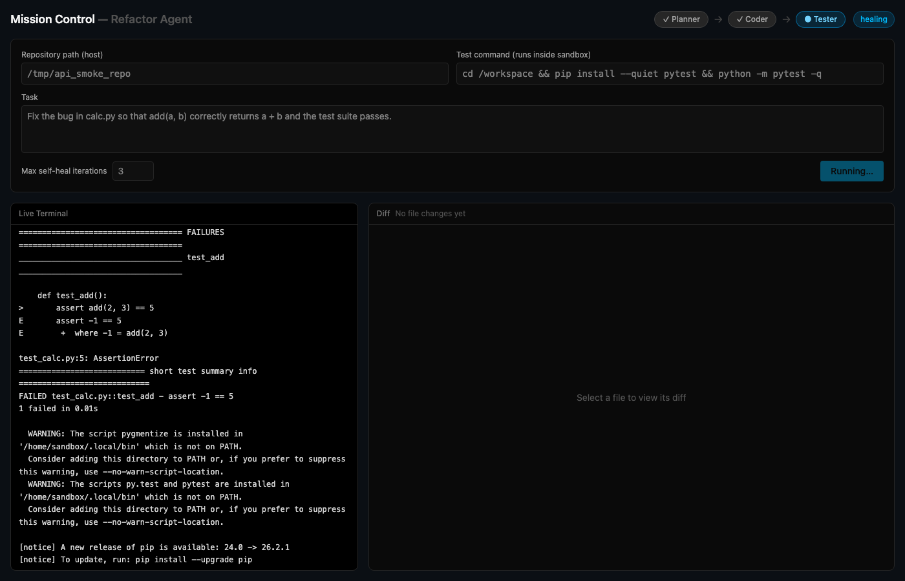
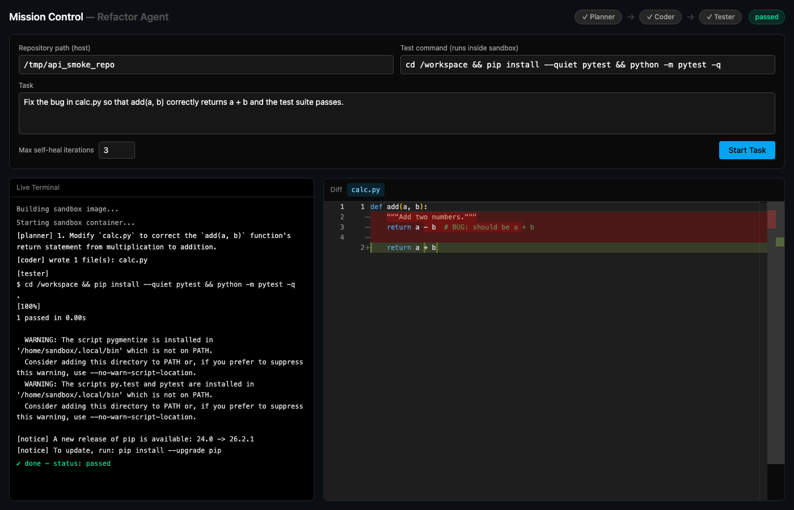

# Autonomous Codebase Refactoring Agent

A local, self-hosted coding agent: give it a plain-English task and a test command, and it plans a fix, writes the code, runs your tests inside an isolated Docker sandbox, and retries with a diagnosed fix if the tests fail — all visible live in a web dashboard. Runs entirely on your machine: local LLM (Ollama), local vector store (ChromaDB), local Docker sandbox. No API keys, no cloud dependency, $0 marginal cost per run.

## Tech stack

| | |
|---|---|
| **Backend** | Python 3.11+, FastAPI, LangGraph, LiteLLM, Docker SDK, ChromaDB, Tree-sitter |
| **Frontend** | React 19 + TypeScript (Vite), Tailwind CSS 4, Monaco Editor, Server-Sent Events |
| **Local default stack** | Ollama (`qwen2.5-coder`), ChromaDB (embedded), Docker Engine |

See [`docs/architecture.md`](docs/architecture.md) for how the pieces fit together — the LangGraph pipeline, the sandbox abstraction, the streaming layer, and the dockerized deployment.

## Screenshots

**Idle, waiting for a task:**


**Mid-run, self-healing after a failed test:**


**Completed, with a real Monaco diff of the fix:**


## Quick start (Docker)

Prerequisites: Docker Desktop running, and [Ollama](https://ollama.com) installed and running natively on the host (kept out of Docker deliberately — see architecture doc).

```bash
ollama pull qwen2.5-coder   # or point LLM_MODEL_NAME at a model you already have

docker compose up -d --build
```

Open **http://localhost:5173**.

The app is uploads-only: the backend container only has access to a scoped `~/.refactor-agent-uploads` directory (mirror-mounted at the same path), not your whole home folder — upload a project folder through the UI rather than typing a host path.

## How to use it

Fill in the form and click **Start Task**:

| Field | Meaning | Example |
|---|---|---|
| Repository | Click "Upload folder" and pick a project folder | — |
| Task | Plain-English description of the fix/refactor | "Fix the off-by-one error in pagination" |
| Test command | Runs inside the sandbox to verify success | `cd /workspace && npm install && npm test` |
| Max self-heal iterations | Retry budget after a failing test | `3` |

While it runs, three panels update live over SSE:
- **Checklist** — which stage is active (Planner → Coder → Tester → SelfHealer) and the final status.
- **Live Terminal** — the plan, which files changed, and raw test output as it happens.
- **Diff** — a real side-by-side Monaco diff for each changed file, once the Coder writes it.

## Running without Docker

For active development on the agent itself (hot-reload on both sides):

```bash
# backend
cd backend && source .venv/bin/activate
uvicorn app.main:app --reload --port 8000

# frontend (separate terminal)
cd frontend && npm run dev
```

Then open http://localhost:5173 (Vite proxies `/api` to the backend on 8000).

## Project layout

```
backend/app/
├── api/       FastAPI routes, SSE, task manager
├── agent/     LangGraph state machine, nodes, prompts
├── drivers/   BaseSandboxDriver, DockerSandboxDriver
├── rag/       Tree-sitter chunker, ChromaDB manager
├── tools/     File/exec/search tools used by agent nodes
└── core/      Config, LiteLLM wrapper, logging
frontend/src/
├── components/  SplitDiffViewer, LiveTerminal, Checklist, TaskForm
└── hooks/       useTaskStream (SSE)
```

More detail, including the full pipeline diagram and the reasoning behind the sandbox/model abstractions, is in [`docs/architecture.md`](docs/architecture.md).
